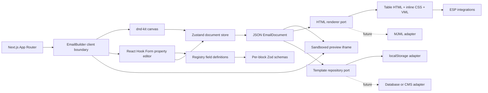

# Architecture

## System overview



The JSON document is the only source of truth. The design canvas and exported email are two renderers over the same structure. UI components never own durable email content.

## Project structure

```text
src/
├── app/
│   ├── (builder)/builder/       # App Router page
│   ├── api/export/              # Validated HTML export endpoint
│   ├── layout.tsx               # Server root and providers
│   └── page.tsx                 # Redirect to the builder
├── components/
│   ├── builder/                 # Shell, toolbar, providers
│   ├── canvas/                  # Recursive visual renderer
│   ├── editor/                  # Generated RHF property forms
│   ├── preview/                 # Sandboxed client preview
│   ├── sidebar/                 # Draggable registry palette
│   └── ui/                      # Shadcn-style primitives
├── constants/                   # Editable starter documents
├── features/
│   ├── rendering/               # Registry and block factory
│   └── templates/               # Query hooks and management UI
├── hooks/                       # Autosave orchestration
├── lib/
│   ├── email/                   # HTML renderer adapter
│   └── utils/                   # Tree, IDs, downloads, styles
├── schemas/                     # Import/document/block validation
├── services/                    # Persistence adapter
├── store/                       # Zustand document/history/UI state
├── tests/                       # Shared test setup
└── types/                       # Domain contracts
```

## Domain model and registry

`EmailDocument` owns campaign metadata, global email settings, and a recursive `EmailBlock[]`. Each block contains an ID, a registered type, serializable properties, and optional children.

The registry is the extension point for content components. Every definition supplies:

- label, description, and palette category;
- whether it can accept children;
- valid default properties;
- ordered, grouped property-field metadata.

The factory creates valid block instances from registry defaults. The property editor reads the same definition, selects the matching Zod schema, and renders fields through `FormProvider` and `useFormContext`. Adding a field does not require a hand-authored form.

## Editing data flow

1. A palette drag carries a block type; a canvas drag carries block ID, parent, index, and nesting capability.
2. The shell resolves the destination and calls a store command.
3. Pure tree utilities insert, remove, clone, locate, or immutably update recursive nodes.
4. The store records the previous document, mutates the current document, clears redo, and flags the draft dirty.
5. The canvas re-renders the affected tree. Property edits stream from React Hook Form into the same command path.
6. Rapid edits to the same form coalesce into one undo step for 700 ms.
7. Autosave debounces the document into the repository. It only clears the dirty flag if the saved revision still matches the current revision.
8. Preview/export validates the complete document, then the HTML renderer walks the same tree.

## State management

| State                                   | Responsibility                        |
| --------------------------------------- | ------------------------------------- |
| `document`                              | Current canonical JSON document       |
| `selectedBlockId`                       | Canvas/property-panel coordination    |
| `past`, `future`                        | Bounded 60-snapshot undo/redo history |
| `isDirty`, `lastSavedAt`                | Draft and autosave feedback           |
| `previewMode`, `emailClient`, `surface` | Editor presentation preferences       |
| `historyKey`, `historyAt`               | Coalescing high-frequency form edits  |

Document commands are colocated in the store; recursive mutation details remain in pure tree utilities. Only the document and preview preferences persist through the Zustand adapter. Saved template collections live behind `templateRepository` and are queried through TanStack Query, keeping editor state and server-state concerns separate.

## Rendering and email compatibility

The HTML adapter produces a complete document rather than browser-oriented React markup:

- layout tables with `role="presentation"`, zero cell spacing, and Outlook table resets;
- inline typography, spacing, colors, widths, and image sizing;
- VML `<v:roundrect>` fallbacks for call-to-action buttons;
- VML background fallback for hero images;
- responsive column stacking at 680 px;
- hidden inbox preheader and Apple reformatting protection;
- light/dark color-scheme metadata and conservative dark-mode rules;
- escaped author content and allow-listed URL protocols;
- heading semantics, descriptive image alt text, link text, and a compliant footer.

The preview runs exported HTML in an iframe with an empty sandbox capability set, not in the host document. Gmail, Outlook, and Apple Mail controls model viewport/client constraints; authoritative compatibility should still be verified through Litmus or Email on Acid before a high-volume send.

`EmailRenderer` is a small port. A future MJML implementation can satisfy that port while the current HTML adapter remains available for exact control.

## Template lifecycle

The browser adapter supports save/update by ID, list, fetch, duplicate, and delete. JSON imports have a 2 MB client limit and pass both the document schema and every type-specific block schema. Exported JSON remains the portable source format; exported HTML is the delivery artifact.

For a multi-user deployment, implement the same repository methods with authenticated route handlers or a service API. Add optimistic concurrency using `version`, organization ownership, and server-side audit history without modifying canvas code.

## Performance strategy

- The email preview is dynamically imported into its own client chunk.
- Canvas blocks are memoized and tree operations use structural sharing.
- Zustand selectors subscribe components to narrow state slices.
- React Hook Form uses uncontrolled fields and direct form-state subscription instead of rerendering the entire form on each keystroke.
- History is capped and high-frequency property updates coalesce.
- Autosave is debounced; template queries have a stale window and no focus refetch.
- The preview renderer is memoized by document revision.
- Email canvases are usually tens or hundreds of blocks. If enterprise templates exceed that range, virtualize only the palette/template list; virtualizing the spatial canvas would degrade drag measurements and accessibility.

## Accessibility

- Palette items and canvas blocks are real focusable controls with visible focus rings and descriptive labels.
- dnd-kit keyboard sensors support pick-up, arrow movement, and drop instructions.
- Canvas selection supports Enter/Space and selected-block deletion supports Delete/Backspace.
- Form errors use `role="alert"`; save/import feedback uses `role="status"`.
- The template sheet is labelled as a modal dialog and closes with Escape.
- Exported headings, links, image alternatives, hidden decorative spacers, and table roles are email-reader friendly.

## Security considerations

- All author text is HTML-escaped before export.
- Link and asset fields only allow HTTP(S), mail, telephone, or fragment protocols as appropriate.
- Zod validates untrusted JSON imports and API request bodies.
- The preview iframe has no script, form, popup, or same-origin permissions.
- Local files are size-limited before parsing, and template count is bounded.
- The export endpoint returns `nosniff` and does not evaluate authored markup.
- Do not place ESP credentials in Client Components. Provider calls belong in authenticated server-only modules or a separate delivery service.
- A hosted version should add authentication/authorization, CSRF protection for cookie-backed mutations, rate and body-size limits, tenant-aware queries, audit logs, encryption at rest, and a strict application Content Security Policy.

## Testing strategy

Vitest and React Testing Library cover:

- HTML structure, VML, responsive rules, and content escaping;
- Zod import, alt-text, and unsafe-link validation;
- nested drop-target tree operations and sortable index behavior;
- Zustand history, property updates, undo, and redo;
- registry-generated React Hook Form fields and live validation.

Playwright contains desktop/mobile smoke coverage for loading the canvas, adding a block, switching to the preview iframe, and opening template management. CI should run lint, typecheck, unit coverage, a production build, Playwright on Chromium, and visual/email snapshots. A release pipeline should additionally test generated fixtures through Litmus/Email on Acid across current Outlook desktop, Outlook web, Gmail web/mobile, Yahoo, Apple Mail, Thunderbird, iOS Mail, and Android Gmail.

## Extensibility roadmap

1. Replace browser persistence with a tenant-aware database repository and authenticated API.
2. Add collaborative presence, optimistic concurrency, revision comparison, and approval workflows.
3. Add an MJML renderer adapter plus HTML equivalence fixtures.
4. Add merge-tag definitions, conditional content, localization, and reusable saved sections.
5. Add asset upload/CDN adapters, image transformation, and link tracking.
6. Add provider adapters for SendGrid, Mailchimp, Salesforce Marketing Cloud, HubSpot, and Dynamics 365 Marketing.
7. Add server-side CSS inlining/minification and delivery-time personalization.
8. Add Litmus/Email on Acid automation, spam checks, accessibility scoring, and inbox analytics.
